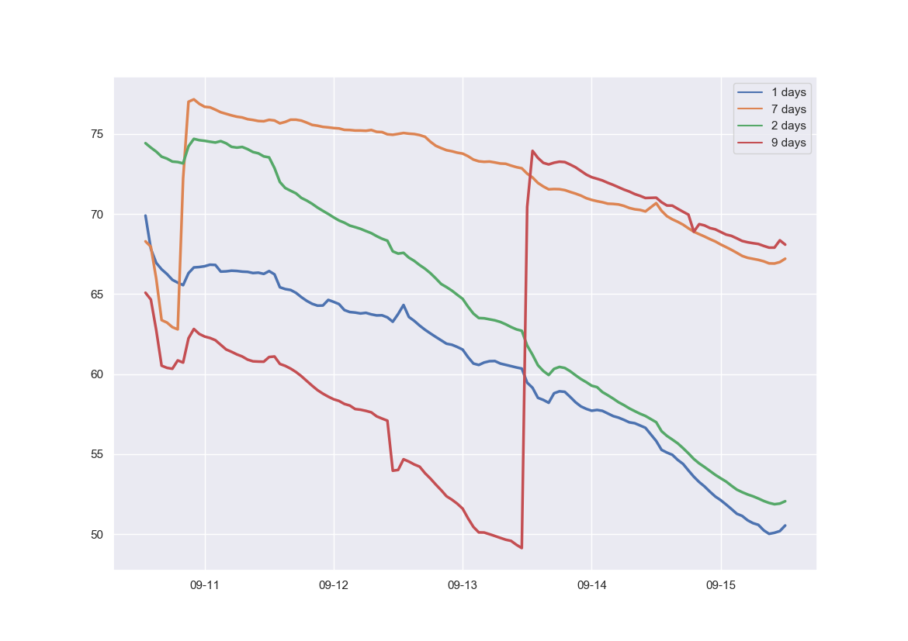

# HUMINO

Monitor soil humidity using a Raspberry Pi, an Arduino and some soil humidity sensors

Read my blog post about this project [here](https://blog.vincentahrend.com/posts/humino/)

## Setup

- Use Python3 and a virtual environment
- `pip install -r requirements.txt` 
- Transfer `humino.ino` to the Ardunino
- Wait a couple of days, then transfer `HUMINO.CSV` to a subdirectory `data`
- Run `python humino.py` to generate `results.png`

## LICENSE

Copyright (c) 2018 Vincent Ahrend

Licensed under the MIT License. See LICENSE file.