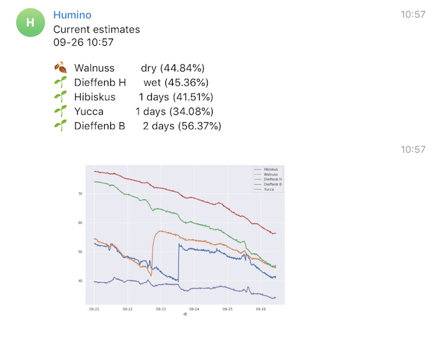

# HUMINO

A Telegram bot running on a Raspberry Pi that uses a connected Arduino and some
soil humidity sensors to monitor your plants and sends you notifications when 
they need to be watered.

Read my blog post about this project [here](https://blog.vincentahrend.com/posts/humino/)

## Setup

- Use Python3 and a virtual environment
- On Raspberry do `apt install libatlas-base-dev` for numpy
- on Raspberry, also `apt install libglib2.0-dev libgirepository1.0-dev libcairo2-dev` and then `pip install PyGObject` for seaborn
- Do `pip install -r requirements.txt` and `pip install jupyter` if you want to use that
- Transfer `humino.ino` to the Ardunino and connect sensors
- Either: Wait a couple of days, then transfer `HUMINO.CSV` to a subdirectory `data`
- Or connect a Raspberry Pi, run `service.py` to read values from Arduino and `humino.py` to make plot + predictions

## LICENSE

Copyright (c) 2018 Vincent Ahrend

Licensed under the MIT License. See LICENSE file.